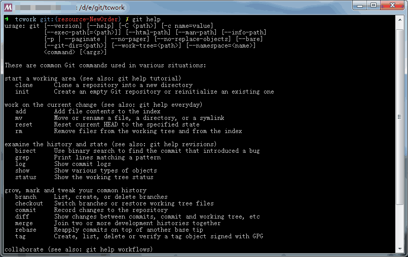
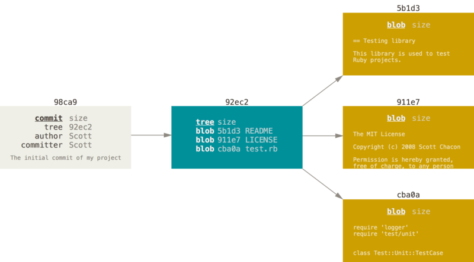
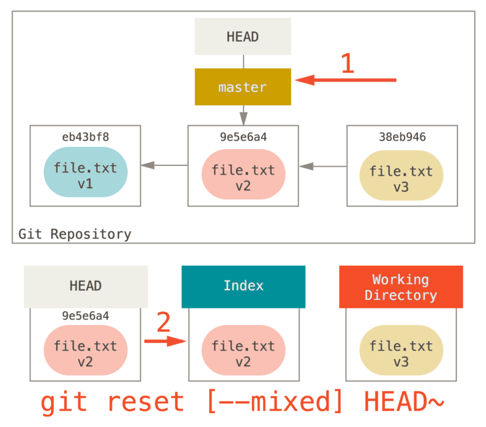

# GIT 学习

<!-- MarkdownTOC depth=3 -->

- 基础与起步
    - 什么是Git？
    - Git与其他版本控制系统的区别
    - Git使用方式
    - 第一次运行Git前的配置
    - 学会使用Git帮助
- Git基本命令学习
    - 创建/获取仓库
    - Git最最最常用到的命令
    - 查看Git提交记录
    - 撤销操作
    - 远程仓库的使用
    - 打标签
- Git分支
    - Git是如何保存数据？
    - 创建分支
    - 切换分支
    - 远程分支
    - 上游分支/跟踪分支
- 一些使用的技巧
- git reset与git checkout命令
    - 图解Git主要流程
    - 作用于提交上
    - 作用在文件上
    - 总结

<!-- /MarkdownTOC -->

## 基础与起步

### 什么是Git？


[什么是版本控制器及版本控制器的分类](https://git-scm.com/book/zh/v2/%E8%B5%B7%E6%AD%A5-%E5%85%B3%E4%BA%8E%E7%89%88%E6%9C%AC%E6%8E%A7%E5%88%B6)

### Git与其他版本控制系统的区别

- 直接记录快照而非差异比较

  其他大部分的版本控制系统以文件变更列表的形式存储信息，将它们保存的信息看做是一组基本文件和每个文件随时间逐步累积的**差异**。
  

  Git更像是把数据看做是对小型文件系统的一组快照。提交时会对当时全部文件作一个快照并保存这个快照的索引；为保持高效，Git不会重新存储没有修改的文件而只保留一个连接指向之前存储的文件；
  

- 几乎所有操作都是本地执行

  多大多数操作都是访问本地文件和资源，一般不需要网络上的其他信息；

- Git保证完整性

  Git中所有数据在存储前都计算校验和，然后以校验和来进行引用。计算校验和的机制叫做SHA-1散列（hash，哈希），由**40个十六进制字符**组成的字符串，是基于**文件内容**或者**目录结构**计算出来的。

- Git一般只添加数据

  执行的git操作，几乎只往git数据库中增加数据。很难让git执行任何不可逆操作或者用任何方式清楚数据。一旦你提交快照到git中，就难以丢失数据。

- **三种状态**

  Git有三种状态，你的文件可能是其中之一
  + 已提交(commited) 数据已安全保存在本地数据库中
  + 已修改(modified) 修改了文件，还没有保存到数据库中
  + 已暂存(staged) 已将修改的文件做了标记，将它包含到下次提交的快照中

  Git的三个工作区概念：Git仓库(Repository)，工作目录(Working Directory)，暂存区(Staging Area)
  

  **Git仓库**用来保存项目的[元数据(Metadata)](http://baike.baidu.com/item/%E5%85%83%E6%95%B0%E6%8D%AE)和对象数据库的地方。

  **暂存区域**是一个文件，保存下次提交文件列表信息，保存在Git仓库目录中。有时也叫“索引(Index)”

  **工作目录**是对项目某个版本独立拉取出来的内容。从Git仓库的压数据库中提取出来的文件，放在磁盘中供使用或编辑。

### Git使用方式

1. 命令行

  

  Terminal, git-bash, 控制台, PowerShell, msys, SublimeText Plugin等

2. GUI软件

  

  [GitHub Desktop](https://desktop.github.com), [SourceTree](https://www.sourcetreeapp.com), [TortoiseGit](https://tortoisegit.org/), Git Extensions等

  + [下载GitHub Desktop](./files/zip/GitHubSetup.rar)
  + [下载SourceTree](./files/zip/SourceTreeSetup_1.9.6.1.rar)

### 第一次运行Git前的配置

Git的全局配置文件位于家目录(Windows下的`%USERPROFILE%`目录，Mac/Linux下的`$HOME`目录)下的`.gitconfig`文件

首次在使用时请配置正确的用户信息，这些信息将会写入每次提交中，不可更改：

```shell
$ git config --global user.name "YOUR NAME"
$ git config --global user.email "YOUR EMAIL"
```

其中`--global`选项用来标识将配置写入全局配置文件中。当我们配置时不加这个选项则这个配置将**只适用于当前**所在的git仓库；

可以通过命令`git config <section>:<key>`来查看某一配置项

```shell
$ git config user.name
Fen
```

### 学会使用Git帮助

对于在windows平台下安装适用git-bash的同学可以在shell中直接输入下面命令查看命令的帮助：

```shell
$ git help <verb>
// 或者
$ git <verb> --help
```

这两个命令会自动打开浏览器可以查看友好的web帮助文档。

而在Mac或者Linux平台下的同学可以直接使用man命令查看帮助。

```shell
$ man git <verb>
// 或者
$ git <verb> --help
```

其中`<verb>`表示具体的命令，比如我们要查看`git config`的帮助文档，直接输入`git config --help` 或者 `git help config` 就可以查看了。

## Git基本命令学习

### 创建/获取仓库

1. 在现有目录中初始化一个仓库

    ```shell
    $ git init
    ```

    在一个目录下运行了该命令后，目录下会新增一个`.git`子目录，这个目录包含了Git仓库所有必要的文件。

2. 克隆现有的仓库

    ```shell
    $ git clone [url]
    ```

    > 使用clone来克隆一个项目时，后面的`url`参数支持一下几种协议：
    >  - 本地协议 `git clone file://path/any.git`
    >  - HTTP协议 `git clone https://somedomain/any.git`
    >  - SSH协议 `git clone ssh://git@somedomain/any.git`
    >
    > 优缺点可以参看[链接](https://git-scm.com/book/zh/v2/%E6%9C%8D%E5%8A%A1%E5%99%A8%E4%B8%8A%E7%9A%84-Git-%E5%8D%8F%E8%AE%AE)

### Git最最最常用到的命令

工作目录下的每一个文件不外乎两种状态：已跟踪和未跟踪。

Git文件变化周期如下：


1. 检查当前文件状态

    查看文件都处于什么状态，可以使用**`git status`**命令。

    加上`-s | --short`选项可以输出一个更紧凑的格式

    > - ?? 表示新添加的文件还没有加入跟踪
    > - A  表示新添加到暂存区域的文件
    > - M  表示修改过的文件
    >   + M- 出现在左边表示被修改并加入暂存区
    >   + -M 出现在右边表示被修改还没有加入暂存区
    >   + MM 表示文件被修改后已加入暂存区后又在工作区被修改了

    `-sb` 显示紧凑格式并显示分支信息

2. 将新文件加入跟踪 / 将修改的文件暂存

    使用命令**`git add [files]`**可以将文件加入跟踪进行版本控制

    该命令还被用来将已修改的文件添加入暂存区域

3. 将不需要追踪的文件加入忽略文件列表中

    在工作区中间一个名为`.gitignore`的文本文件，在里面可以添加需要忽略的文件。

    文件`.gitignore`的格式规范：

    + 所有空行或者以`#`开头的行都会被忽略
    + 支持标准的glob模式匹配
    + 可以以`/`开头防止递归
    + 可以以`/`结尾指定目录
    + 在模式前加`!`表示取反

    > glob模式是简化的正则表达式：
    >
    > `*`匹配另个或多个任意字符；`[abc]`匹配方括号中的字符；`?`只匹配一个任意字符；`[0-9]`表示匹配所有0到9的数字；使用`**`匹配任意中间目录，如`a/**/z`。

    在[这里](https://github.com/github/gitignore)可以找到数十几种项目及语言的`.gitignore`文件

4. 查看已暂存和未暂存的修改内容

    使用`git diff`命令可以查看比`git status`更为详细的变化信息，可以通过该命令在添加到暂存区之前查看文件修改了那些部分。

    > 如果已经将文件加入暂存区（即使用了`git add`命令后）使用上面的命令将看不到任何信息，可以在改命令后添加一个选项`--cached`或`--staged`即可查看；`git diff`本身值显示**尚未暂存**的改动；

5. 提交更新

    使用`git commit`命令可以将暂存区的文件提交到git数据库中。在此之前请先使用`git status`查看是否将所有编辑过的内容添加到暂存区；

    在运行完该命令后会显示一个编辑器一般情况下显示的是`vim`编辑器，该编辑器是一款运行在终端下的编辑器，所有操作都靠键盘命令完成。

    列出一些常用的vim下的命令

    - `i` 进入编辑模式
    - `↑`,`↓`,`←`,`→` 用来移动光标
    - `ESC` 退出编辑模式进入命令模式
    - `:q` 退出
    - `:w` 保存
    - `:q!` 强制退出，不保存编辑的内容
    - `:x` 保存并退出

    一般情况下直接运行`git commit`后进入vim编辑器是命令模式，在该模式下可以进行光标移动等操作，然后按键盘上的`i`键，进入编辑模式，就可以在光标所在处开始编辑文字了，编辑完后按`ESC`退出编辑模式进入命令模式，一般只需键入`:x`即可保存并退出。

    默认情况下提交内容包含了一些信息包含了改动了那些文件，内容和`git status`输出的内容一致，如果想要更详细的内容可以使用`-v`选项，将会显示和`git diff`一样的内容作为注释；

    也可以使用`-m`选项后面直接编写提交信息；

    ```shell
    $ git commit -m "balabalaba"
    ```

    加上`-a`选项可以跳过`git add`命令，直接提交；**注**使用该选项不会添加新的未追踪文件，未追踪文件还是需要使用`git add`添加到暂存区中。

6. 删除文件

    使用命令`git rm`来将文件从暂存区域移除

    如果我们直接在工作目录中将文件删除，运行`git status`会提示删除的文件未被包含到暂存清单中，再次运行`git rm`命令可以完成将文件从暂存区域移除。

    如果在文件删除之前有修改过并已经放入暂存区，必须要添加强制删除选项`-f`。

    如果想将文件从暂存区域移除，但还想将文件保留在工作目录中，可以使用`--cached`选项；可以使用该命令使文件不再被git追踪。

    ```shell
    $ git rm <file>
    $ git rm -f <file>
    $ git rm --cached <file>
    ```

    > 注：命令后可以是一个文件或者目录，并支持glob模式；

7. 文件重命名

    Git不会显式跟踪文件移动操作，如果在git中重命名了某个文件，仓库中的元数据并不会体现这一次改名操作

    ```shell
    $ git mv <old name> <new name>
    ```

### 查看Git提交记录

在Git中使用`git log`命令来查看历史提交记录；

| 选项 | 可选值 | 说明 |
|:---:|:---:|:---|
|`-p`/`--patch`|| 显示提交记录中的文件内容差异 |
|`--stat`|| 显示每次提交的简略统计信息 |
|`--pretty`|oneline, short, full, fuller, format|按不同格式展示提交历史|
|`--graph`||用一些ASCII字符来展示分支，合并历史|
|`--decorate`||用来显示分支|
|`--abbrev-commit`||仅显示SHA-1前几个字符，而非完整的字符|
|`--relative-date`||显示相对时间|
|`--since`/`--after`||可以用来限制历史记录的开始日期|
|`--until`/`--before`||用来限制实例记录的结束日期|
|`-<n>`|数字|用来限制显示条数|
|`--author`|作者名|用来指定提交作者名|
|`--grep`|关键字|韩式含指定关键字的提交|
|`-g`/`--walk-reflogs`|||

### 撤销操作

1. 修改最近一次提交

    在提交完后如果发现漏掉几个文件或者提交信息写错，可以运行带有`--amend`尝试重新提交

    ```shell
    $ git commit --amend
    ```

    最终只会有一个提交 - 第二次提交将代替第一次提交

2. 撤销暂存区的文件

    ```shell
    $ git reset <file>
    ```

3. 撤销对工作区文件的修改[WARNING]

    ```shell
    $ git checkout -- <file>
    ```

    > **注** 这是一个很危险的操作，会重置你在工作区的所有修改

### 远程仓库的使用

查看远程仓库 `git remote`

`-v` 选项，会显示远程仓库简写名与其对应的URL

添加远程仓库 `git remote add <shortname> <url>`

从远程仓库中抓取与拉取

`git fetch [remote-name]` 从远程仓库中拉取你本地没有的数据；会抓取所有的数据，拥有远程分支所有分支引用，可以随时查看合并。

`git pull` 同样是从远程仓库中拉取，但是该命令只会拉取当前分支对应的远程分支数据并尝试合并。

推送到远程仓库 `git push [remote-name] [branch-name]`

查看远程仓库更多信息 `git remote show <remote-name>`

远程仓库重命名 `git remote rename <old-remote-name> <new-remote-name>`

移除远程仓库 `git remote rm <remote-name>`

### 打标签

查看标签列表 `git tag`

使用特定模式查找标签 `git tag -l 'v1.8.5*'`

**创建标签**

> 标签很像一个不会改变的分支 - 它只是一个特定提交的引用；

- 轻量标签 (lightweight)

    本质上是讲一个提交的校验和存储到一个文件中 - 没有任何其他标签

    创建方法是在命令后直接跟上标签名字就可以了

    ```shell
    $ git tag v1.0.5
    ```

- 附注标签 (annotated)

    附注标签是存储在Git数据库中的一个完整对象；可以被校验的，包括打标签者的名字，电邮，日期时间，还有一个标签信息

    ```shell
    $ git tag -a v1.4 -m "这是一个临时版本"
    ```

|选项|说明|
|:---:|:---|
|-a, --annotate|说明是一个附注标签|
|-d|删除一个标签|
|-l <pattern>, --list <pattern>|查看标签列表，后面可以跟匹配模式进行查找|
|-m <msg>, --message=<msg>|给标签添加注释信息，`-m`选项必须带上`-a`选项|

> 可以使用命令 `git show [tag-name]` 查看标签详细信息

推送标签到远程仓库 `git push [remote-name] [tag-name]`

推送所有标签到远程仓库 `git push [remote-name] --tags`

将标签检出到一个分支 `git checkout -b [branch-name] [tag-name]`

## Git分支

### Git是如何保存数据？

在我们使用`git add .`命令往暂存区添加文件时，Git会先计算**每一个文件的校验和**，然后会把当前版本的文件**快照**保存到Git仓库中（Git使用**blob**对象来保存它们），最终将校验和加入到**暂存区**等待提交。

当使用`git commit`进行提交时，Git会计算每一个**子目录**的校验和，然后在Git仓库中将这些校验和保存成为**树对象**；然后Git产生一个**提交对象**，一个提交对象中包含了**姓名**，**邮箱**，提交时输入的**注释信息**和一个指向该树对象的**指针**。这样在我们需要时，Git就可以拉取到保存的快照了。

每一个提交对象还会有一个指向**父对象**的指针，**首次**提交*没有*父对象，**普通提交**会有*一个*父对象，而由**多个分支合并**产生的提交对象会有*多个*父对象；

首次提交：



多次提交后，提价对象中会有一个指向上一次提交对象（父对象）的指针；


*Git的分支其本质仅仅是指向提交对象的可变指针*

> `master`分支并不是一个特殊分支，它和其他分支没有区别，之所以几乎所有的仓库都有master分支，是因为`git init`命令会默认创建它；


### 创建分支

创建新分支只是为你创建一个可以移动的新指针；使用`git branch [new-branch]`创建；

```shell
$ git branch testing
```


Git中有一个名为`HEAD`的特殊指针，用来指向当前所在的本地分支；


可以使用`git log --decorate --graph --oneline`来查看各个分支指向的对象

### 切换分支

`git checkout [branch-switch-to]`

### 远程分支

远程引用是对远程仓库的引用（指针），包括分支，标签等等。

可以通过`git ls-remote`来显式获得远程引用的完整列表，或通过使用`git remote show [remote-name]`获取远程分支更多信息。

使用命令`git push [remote-name] [branch]`将本地修改推送到远程仓库

使用这个命令git会将分支名称展开，例如我们使用`git push origin test`将本地test分支推送到远程，git展开后为`git push origin refs/heads/test:refs/heads/test`，推送本地的test分支更新远程的test分支；也可以用`git push origin test:test` 做同样的事情；

`git push [remote-name] [local-branch]:[remote-branch]`

删除远程分支 `git push [remote-name] :[remote-branch]` 或者 `git push origin --delete [branch]`

### 上游分支/跟踪分支

一个远程分支检出一个本地分支会自动创建一个“跟踪分支”。跟踪分支是与远程分支有直接关系的本地分支。如果在一个跟踪分支上输入`git pull`，Git会自动识别去哪个服务器上抓取，合并哪个分支

使用`git checkout -b [branch] [remote-name]/[branch]`将检出一个跟踪分支
使用`git checkout --track [remote-name]/[branch]`一样的效果

使用`git branch --set-upstream-to [remote-name]/[branch]` 或者 `git branch -u [remote-name]/[branch]`来修改上游分支或者给本地分支绑定一个上游分支

## 一些使用的技巧

`git show <hash|branch>` 来查看一次指定的提交

`git reflog` 查看引用日志，引用日志记录了进几个月HEAD和分支引用指向的历史。

`git log -g` 可以查看类似`git log`输出风格的引用日志

`git show HEAD^` 查看HEAD的父提交 HEAD^2 查看HEAD的第二个父提交（一般用在合并的提交）

`git show HEAD~` 查看HEAD的父提交 HEAD~2 查看HEAD父提交的父提交

`git log <branchA>..<branchB>` 查看B分支还有那些内容没有合并到A分支

`git stash` 或 `git stash save` 将当前分支的修改储藏起来

`git stash list` 查看储藏列表

`git stash apply [stash@{number}]` 将储藏起来的数据重新应用到工作区，可以指定应用那一条储藏

`git stash pop` 应用最近一条储藏并删除储藏信息

`git grep -n <keyword>` 从工作目录中查找一个字符串或者正则表达式，`-n`找出匹配行行号

## git reset与git checkout命令

> `reset`命令会移动HEAD以及**HEAD所处分支**的指向

> `checkout`命令只会移动HEAD指向

`git reset`会有三个常用的选项 `--soft`, `--mixed`以及`--hard`

### 图解Git主要流程

`git init` 初始化一个Git仓库


`git add` 往暂存区添加一个文件


`git commit` 提交


### 作用于提交上

`git reset --soft HEAD~` 重置到上一个提交上


本质上是撤销了上一次`git commit`命令；

**不会改变索引和工作目录**

`git reset [--mixed] HEAD~` 移动HEAD及对应分支到指定提交上，**并更新索引的内容**



`git reset --hard HEAD~` 移动HEAD及对应分支到指定提交上，更新索引内容，**并更新工作目录**


> 总结：
>
> reset命令会以特定的顺序重写这三棵树（Git仓库，暂存区，工作目录）
> 1. 移动HEAD及HEAD对应分支的指向 （如果指定`--soft`选项，到此为止）
> 2. 更新暂存区，使其内容为HEAD的内容 （如果**未**指定`--hard`选项，到此为止）
> 3. 更新工作目录，是其内容为暂存区的内容 （使用`--hard`选项）

`git checkout HEAD~` 只是移动HEAD指向

### 作用在文件上

`git reset`后面如果跟一个作用路径，`reset`将会跳过上面讲到的第一步，并且将它的作用范围限定为指定的文件或目录。

例如`git reset file.txt` （其实是`git reset --mixed HEAD file.txt`的简写），它的作用如下图


本质是从HEAD中将文件复制到暂存区中。做的和`git add file.txt`相反的动作，这就是为什么`git status`上面会用这条命令来取消暂存一个文件；

我们还可以在指定的提交中来去文件的对应版本 `git reset <commit> file.txt`


`git checkout`也可以指定一个特定的文件目录，像`reset`一样不会移动HEAD，它会用指定的提交更新索引并会覆盖工作目录中的对应文件。

`git checkout [commit] file`，所以我们会在`git status`中看到提示，可以用该命令撤销未提交到暂存区的文件

### 总结

||HEAD指向|暂存区|工作区|是否安全|
|:---|:---:|:---:|:---:|:---:|
|作用于提交上|
|reset --soft <commit>|移动HEAD以及HEAD对应的分支指向|/|/|Y|
|reset [--mixed] <commit>|移动HEAD以及HEAD对应的分支指向|使暂存区像HEAD|/|Y|
|reset --hard <commit>|移动HEAD以及HEAD对应的分支指向|使暂存区像HEAD|使工作目录像暂存区|**N**|
|checkout <commit>|移动HEAD指向|使暂存区像HEAD|使工作目录像暂存区|Y(之所以说这个是安全的因为`checkout`更智能会自动判断)|
|作用于文件上|
|reset [--mixed] [commit] -- <file>|/|使暂存区像HEAD|/|Y|
|checkout [commit] -- <file>|/|使暂存区像指定提交|使工作目录像暂存区|**N**|
